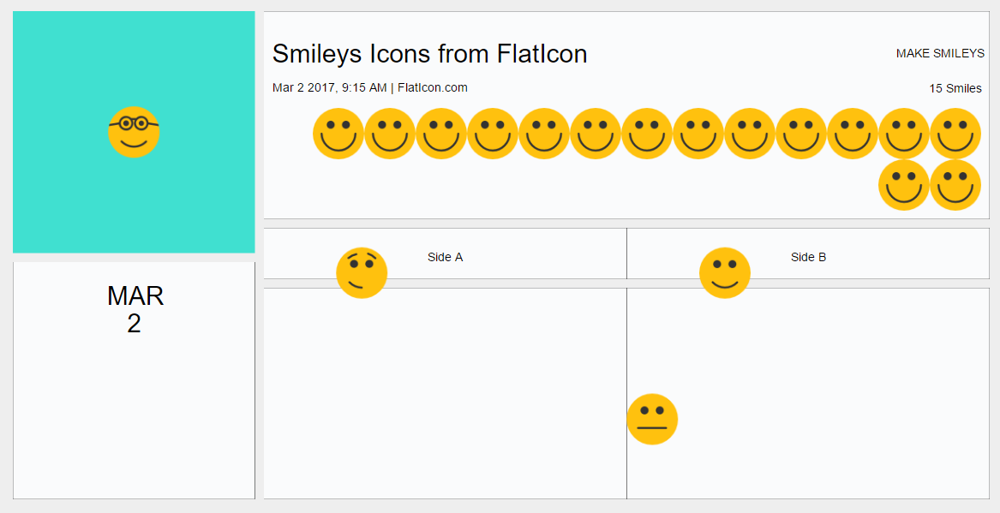

# placard
A javascript CSS FlexBox (Flexible Layout) based declarative layout managers for generating dynamic SVGs and images. Implemented using [{{mustache}}](https://github.com/janl/mustache.js/) and [yoga](https://github.com/facebook/yoga)

#### Re-define how and where you are using SVGs 
SVGs are great for displaying vector graphics and for data visualizations like graphs, charts. But, With its XML format and CSS styling it could be used in diverse use cases. [Placard](https://github.com/jaladankisuresh/placard) is built leveraging its serialized data representation structure (i.e XML and CSS) that is easy to manipulate dynamically; 

Using it as data-driven template and layout manager
- [Mustache](https://mustache.github.io/) templating to bind data dynamically
- [Yoga](https://github.com/facebook/yoga) [CSS FlexBox based layout engine] for dynamically positioning elements in the SVG 

# Usage
Placard Libarary uses [Yoga](https://github.com/facebook/yoga) under-the-hood for generating layouts, and for calculating elements X, Y WIDTH and HEIGHT properties. However, unlike Yoga which follows [camelCase](https://facebook.github.io/yoga/docs/flex-direction/) naming convention, Placard follows [CSS Flexible Box Layout](https://developer.mozilla.org/en-US/docs/Web/CSS/CSS_Flexible_Box_Layout) naming standards. 

Placard implements the following CSS FlexBox properties; *It mostly likely has one-to-one mapping with every Yoga Flex property*  
  
*align-content  
align-items  
align-self  
flex  
flex-direction  
flex-flow  
flex-grow  
flex-shrink  
flex-wrap  
justify-content*  

#### Additions (specific to this library)
*position-type* for setting child position to either absolute or relative. refer yoga [documentation](https://facebook.github.io/yoga/docs/absolute-position/)  

Set x, y, width and height Explicity for Skiping
Use explict attribute setting to avoid placard from calculating X, Y, WIDTH and HEIGHT for the element and setting the same. 
```XML
<!-- Placard would respect these attributes and would not try to calculate these values -->
<image x="60%" y="10%" width="60" height="60"
    xlink:href="./assets/icons/smiling.png"/>
```

### Hello {{SVG}}! Example  
**SET flex-css attribute**  
Placard parses **flex-css** attribute defined in the elements looking for CSS FlexBox properties, and calculates X,Y, WIDTH and HEIGHT for the element

SVG template
```XML
<svg xmlns="http://www.w3.org/2000/svg" version="1.1"
  xmlns:xlink="http://www.w3.org/1999/xlink" height="630" style="background-color:#eeeeee"
  width="1200" flex-css="padding: 20;flex-direction: column;justify-content:center;align-items:center;">
  <svg flex-css="flex-direction: column;width:600;aspect-ratio:1;align-items:center;">
    <rect flex-css="position-type: absolute;width:100%;height:100%"
       style="fill:#fafbfc;stroke:#000000;stroke-width:0.5;stroke-opacity:1" />
    <rect flex-css="width:20%;aspect-ratio:0.5;"
       style="fill:#40e0d0;stroke-width:0.5" />
    <svg flex-css="width:100%;aspect-ratio:4;justify-content:center;align-items:center;">
      <rect flex-css="position-type: absolute;width:100%;height:100%"
         style="fill:#ffc0cb;stroke-width:0.5" />
      <text style="font-size:50">Hello {{name}}!</text>
    </svg>
    <rect flex-css="width:20%;aspect-ratio:0.5;"
       style="fill:#40e0d0;stroke-width:0.5" />
  </svg>
</svg>
```
Data binding and Executing
```javascript
let helloSVGTemplate = fs.readFileSync('templates/hello-svg-template.svg', 'utf-8');
let svgContentString  = Mustache.render(helloSVGTemplate, {name : 'SVG'});
var xmlDoc = new DOMParser().parseFromString(svgContentString,'text/xml');
placard.svgTemplatingCtrl.requestYogaLayout(xmlDoc);
let svgLayoutCompleteString = new XMLSerializer().serializeToString(xmlDoc);
fs.writeFile('hello-svg.svg', svgLayoutCompleteString, function() {
  console.log('output svg written to out.svg');
});
```


### Nested Layouts Example
SVG template
```XML
<svg xmlns="http://www.w3.org/2000/svg" version="1.1"
  xmlns:xlink="http://www.w3.org/1999/xlink" height="630" style="background-color:#eeeeee"
  width="1200" flex-css="padding: 20;flex-direction: row;">
  <svg class="left-column-layout" flex-css="padding-top:10;padding-left:10;padding-bottom:10;flex-direction: column;flex: 1;">
    <svg flex-css="flex-direction: column;flex:none;align-items:center;justify-content:center;aspect-ratio:1;">
      <rect flex-css="position-type: absolute;width:100%;height:100%"
        style="fill:#40e0d0;stroke-width:0.5" />
      <image
         xlink:href="{{info.thumbnail}}"
         flex-css="height:60; width :60;"/>
    </svg>
    <svg class="left-column-bottom-layout" style="background-color:#fafbfc" flex-css="flex:1;margin-top:10;flex-direction: column;align-items:center">
      <rect flex-css="position-type: absolute;width:100%;height:100%"
         style="fill:#fafbfc;stroke:#000000;stroke-width:0.5;stroke-opacity:1" />
         <text xml:space="preserve;" flex-css="margin-top:20" style="font-size:30">{{info.month}}</text>
         <text xml:space="preserve;" flex-css="margin-top:10" style="font-size:30">{{info.day}}</text>
    </svg>
  </svg>
  <svg class="right-column-layout" flex-css="padding:10;flex-direction: column;flex: 3;">
    <svg flex-css="flex-direction: column;flex: 2 0 auto;">
      <rect flex-css="position-type: absolute;width:100%;height:100%"
         style="fill:#fafbfc;stroke:#000000;stroke-width:0.5;stroke-opacity:1" />
      <svg flex-css="flex-direction: row;align-items: center;margin-top:20;padding:10;justify-content:space-between;">
        <text xml:space="preserve" style="font-size:30">{{info.name}}</text>
        <text xml:space="preserve">{{info.sport}}</text>
      </svg>
      <svg flex-css="flex-direction: row; align-items: center;padding:10;justify-content:space-between;">
        <text>{{info.datetime}} | {{info.location}}</text>
        <text>{{info.goingList.length}} Smiles</text>
      </svg>
      <svg flex-css="flex-direction: row;padding:10;">
        <!--<text>{{info.location}}</text>-->
        <svg flex-css="flex-direction: row;justify-content:flex-end;flex-wrap:wrap">
          {{#info.goingList}}
          <image
             xlink:href="{{img}}"
             flex-css="height:60; width :60;"/>
          {{/info.goingList}}
        </svg>
      </svg>
    </svg>
    <svg flex-css="flex:5">
      <svg flex-css="flex-direction: row;margin-top:10;justify-content:center;height:60; flex: none;">
        <svg flex-css="flex-direction: column;justify-content:center;align-items:center;flex: 1;">
          <rect flex-css="position-type: absolute;width:100%;height:100%"
             style="fill:#fafbfc;stroke:#000000;stroke-width:0.5;stroke-opacity:1" />
          <text>{{sideA.name}}</text>
        </svg>
        <svg flex-css="flex-direction: column;justify-content:center;align-items:center;flex: 1;">
          <rect flex-css="position-type: absolute;width:100%;height:100%"
             style="fill:#fafbfc;stroke:#000000;stroke-width:0.5;stroke-opacity:1" />
          <text>{{sideB.name}}</text>
        </svg>
      </svg>
      <svg flex-css="flex-direction: row;margin-top:10;justify-content:center;flex: 5;">
        <svg flex-css="flex-direction: column;flex: 1;">
          <rect flex-css="position-type: absolute;width:100%;height:100%"
             style="fill:#fafbfc;stroke:#000000;stroke-width:0.5;stroke-opacity:1" />
        </svg>
        <svg flex-css="flex-direction: column;flex: 1;">
          <rect flex-css="position-type: absolute;width:100%;height:100%"
             style="fill:#fafbfc;stroke:#000000;stroke-width:0.5;stroke-opacity:1" />
        </svg>
        <image x="50%" y="50%" width="60" height="60" 
          xlink:href="./assets/icons/disappointed.png"/>
      </svg>
      <image x="10%" y="10%" width="60" height="60"
        xlink:href="./assets/icons/confused.png"/>
      <image x="60%" y="10%" width="60" height="60"
        xlink:href="./assets/icons/smiling.png"/>
    </svg>
  </svg>
</svg>
```



# Layout Managers

### Horizontal Layout
```XML
<svg flex-css="flex-direction: row;justify-content:space-between;align-items: center;padding:10;">      
</svg>
```
### Vertical Layout
```XML
<svg flex-css="flex-direction: column;align-items: center;margin:20;">      
</svg>
```
### Relative Layout
This is the standard behaviour for child elements in SVG. All the children of <SVG> are layed out relative to thier parent <SVG> tag.
```XML
<svg>  
  <image x="10%" y="10%" width="60" height="60"
    xlink:href="./assets/icons/confused.png"/>
  <image x="60%" y="10%" width="60" height="60"
    xlink:href="./assets/icons/smiling.png"/>
</svg>
```
### Flow Layout
{{#info.goingList}} {{/info.goingList}} are [mustache](https://mustache.github.io/) binding variables that are replaced dynamically
```XML
<!--layout images right to left and wrap to next line if the content overflows-->
<svg flex-css="flex-direction: row;justify-content:flex-end;flex-wrap:wrap">
  {{#info.goingList}}
  <image
     xlink:href="{{img}}"
     flex-css="height:60; width :60;"/>
  {{/info.goingList}}
</svg>
```

# Side Affects
You could generate PNG images from SVG using npm modules like
1. [gm](https://github.com/aheckmann/gm)
2. [svg2png](https://github.com/domenic/svg2png)

# Attribution
Inspired by [Scott Logic Blog](http://blog.scottlogic.com/2015/02/02/svg-layout-flexbox.html) By Colin Eberhardt  
Icons made by [Roundicons](http://www.flaticon.com/authors/roundicons) from [Flaticon](http://www.flaticon.com) is licensed by [Creative Commons BY 3.0](http://creativecommons.org/licenses/by/3.0/)

# Contribute
You are welcome to do a pull request. It would greatly help this module if it could find more contributors to build it and test it.
Alternatively, If you are using placard in your work, you may share how you are using it.

# License
open sourced with [MIT](./License.md) license

NOTE : SOFTWARE IS PROVIDED 'AS IS', WITHOUT ANY WARRANTY.
